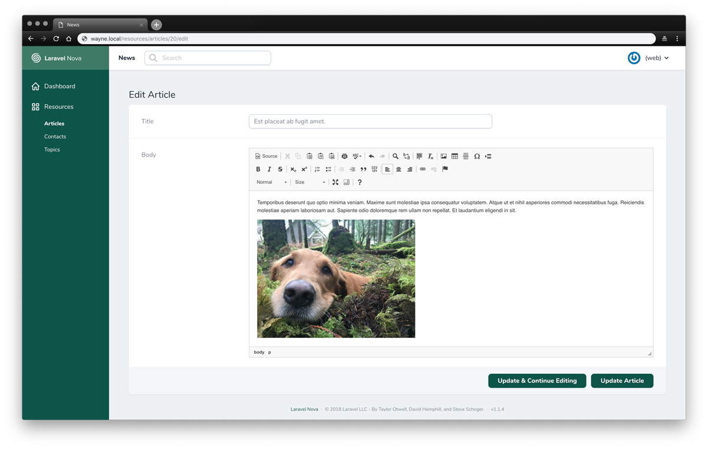

# Laravel Nova CKEditor 4 Field

This nova package allows you to use [CKEditor 4](https://ckeditor.com/ckeditor-4/) for text areas using Nova v4.



## Installation

[Nova v1, v2, v3 compatibility instructions](https://github.com/waynestate/nova-ckeditor4-field#nova-v1-v2-or-v3-compatibility)

You can install the package into a Laravel application that uses [Nova](https://nova.laravel.com) via composer:

```bash
composer require waynestate/nova-ckeditor4-field
```

By default the CKEditor 4 instance used is the latest (4.19.0) Full All version (https://cdn.ckeditor.com/). If you wish to use a different CKEditor 4 you can do so by publishing and editing the configuration.

## Usage

```php
<?php

namespace App\Nova;

use Waynestate\Nova\CKEditor;

class Article extends Resource
{
    // ...

    public function fields(Request $request)
    {
        return [
            // ...

            CKEditor::make('Body', 'body');
                
            // ...
        ];
    }
}
```

## Overriding Config Values

To change any of config values, publish a config file:

```bash
php artisan vendor:publish --tag=nova-ckeditor4-field-config
```

## Customization

### Configuration options
You can change the [configuration options](https://ckeditor.com/docs/ckeditor4/latest/api/CKEDITOR_config.html) of the CKEditor instance by either editing the published config file at `nova.ckeditor-field.options`

```php
    /*
    |--------------------------------------------------------------------------------
    | CKEditor Options
    |--------------------------------------------------------------------------------
    |
    | To view a list of all available options checkout the CKEditor API documentation
    | https://ckeditor.com/docs/ckeditor4/latest/api/CKEDITOR_config.html
    |
    */
    'options' => [
        'toolbar' => [
            ['Source','-','Cut','Copy','Paste','PasteText','PasteFromWord','-','Print', 'SpellChecker', 'Scayt'],
            ['Undo','Redo','-','Find','Replace','-','SelectAll','RemoveFormat'],
            ['Image','Table','HorizontalRule','SpecialChar','PageBreak'],
            '/',
            ['Bold','Italic','Strike','-','Subscript','Superscript'],
            ['NumberedList','BulletedList','-','Outdent','Indent','Blockquote','CreateDiv'],
            ['JustifyLeft','JustifyCenter','JustifyRight'],
            ['Link','Unlink','Anchor'],
            '/',
            ['Format','FontSize'],
            ['Maximize', 'ShowBlocks','-','About']
        ]
    ],
```

or you can pass it with the `options` method using:

```php
public function fields(Request $request)
{
    return [
        // ...

        CKEditor::make('Body', 'body')->options([
            'height' => 300,
            'toolbar' => [
                ['Source','-','Cut','Copy','Paste'],
            ],
        ]),

        // ...
    ];
}
```

### File Uploads
The `nova-ckeditor4-field` allows the use of file uploads by extending the attachment functionality of the [Trix field](https://nova.laravel.com/docs/4.0/resources/fields.html#trix-file-uploads)

```bash
php artisan vendor:publish --tag=nova-ckeditor4-field-config # Make sure the config file is published
php artisan vendor:publish --tag=nova-ckeditor4-field-migrations
php artisan migrate
```

Within the published `/config/nova/ckeditor-field.php`, if you wish to not use the default `Attachment` and/or `PendingAttachment` models. You could replace with your own:
```php
    'attachment_model' => \Waynestate\Nova\Models\Attachment::class,
    'pending_attachment_model' => \Waynestate\Nova\Models\PendingAttachment::class,
```

Like the Trix field you'll be able to chain the method `withFiles` onto the field's definition, while passing the name of the filesystem disk where the images should be stored:
```php
use Waynestate\Nova\CKEditor;

CKEditor::make('Body')->withFiles('public');
```

Also to prune any stale attachments from the storage and table, you'll want to register a [job](https://laravel.com/docs/9.x/scheduling#introduction) to run periodically:
```php
use Waynestate\Nova\Jobs\PruneStaleAttachments;

/**
* Define the application's command schedule.
*
* @param  \Illuminate\Console\Scheduling\Schedule  $schedule
* @return void
*/
protected function schedule(Schedule $schedule)
{
    $schedule->call(function () {
        (new PruneStaleAttachments)();
    })->daily();
}
```

### Custom CKEditor Instance
If you wish to not use the CKEditor from the CKEditor CDN, you can change the `ckeditor_url` under `config/nova/ckeditor-field.php` to point to the URL of the CKEditor you wish to use.

If you wish to go the route of a Custom CKEditor Instance using Composer then follow the steps at [Using Composer for Custom CKEditor Instance](https://github.com/waynestate/nova-ckeditor4-field/wiki/Using-Composer-for-Custom-CKEditor-Instance)

## Nova v1, v2, or v3 compatibility
If you require the use of `nova-ckeditor4-field` using Nova v1, v2 or v3, you can install using version [0.7.0](https://github.com/waynestate/nova-ckeditor4-field/releases/tag/0.7.0)

```bash
composer require waynestate/nova-ckeditor4-field:"^0.7.0"
```

## Contributing

Please see [CONTRIBUTING](CONTRIBUTING.md) for details.

## License

The MIT License (MIT). Please see [License File](LICENSE.md) for more information.
